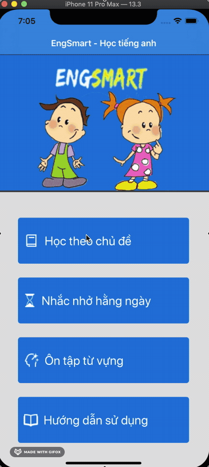
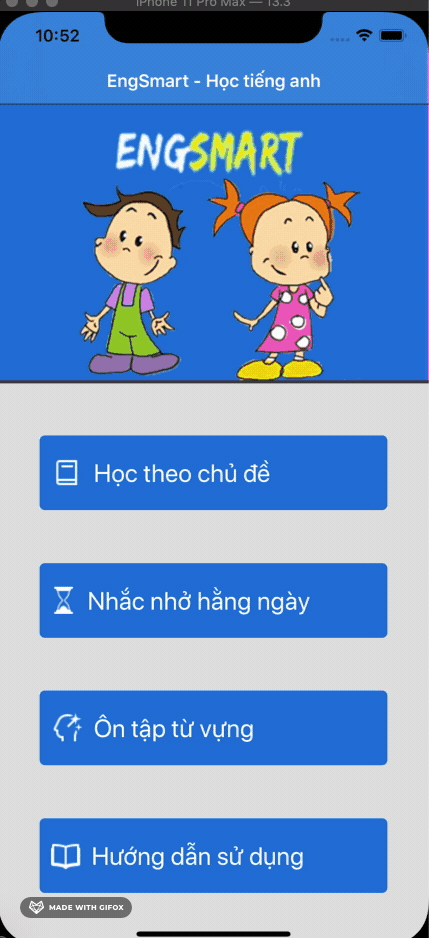

# TestApp
## App học tiếng anh 
### Mục lục

[I. Mở đầu](#Modau)

[II. Nội dung chính App](#noidungchinhapp)
- [1. Học theo chủ đề](#Họctheochủđề)
- [2. Nhắc nhở hằng ngày](#nhacnhohangngay)
- [3. Ôn tập từ vựng](#ontaptuvung)
- [4. Hướng dẫn sử dụng](#huongdansudung)

## I. Mở đầu
sử dụng app học gồm 600 từ vựng toeic - chia thành 50 nhóm khác nhau :

## II. Nội dung chính App
### 1. Học theo chủ đề:
gồm các màn hình : Nhóm từ học , danh sách từ trong nhóm, câu hỏi trả lời nhanh, kết quả thu được.
- Nhóm từ học: sử dụng collectionView hiện các nhóm từ học chọn một nhóm để bắt đầu học
- danh sách từ trong nhóm: sử dụng TableView hiện các từ sẽ bao gồm các (từ - phiên âm), (đồng nghĩa bằng tiêng anh), và nghĩa tiếng việt chọn bài kiểm tra nhanh để nhớ
- câu hỏi trả lời nhanh: kiểm tra nhanh sẽ bao gồm Label câu hỏi và list TableView các câu trả lời chọn 1 đáp án sẽ chuyển câu (nhờ sử dụng GCD(berrier) - main Queue để chuyển màn) . cuối cùng là đánh giá 
- kết quả: đánh giá kết quả sẽ có số câu đúng/ tổng số, nút nhấn trở về các mục mong muốn

### 2. Nhắc nhở hằng ngày
gồm các màn hình : danh sách công việc, thêm danh sách công việc, sửa công viêc, thời gian
- danh sách công việc: Sử dụng TableView có danh sách báo thức thể hiện thông tin thời gian - UISwitch - nội dung cần lưu ý, có thể thêm, xóa , sửa sử dụng RealmData
- thêm danh sách công việc: Thêm danh sách công việc : sử dụng DatePicker hiển thị thời gian, nội dung công việc.
- sửa công viêc, thời gian: dùng Singleton để đản bảo tái sử dụng, chỉ có 1 thao tác đang được sử dụng với nó đê thay đổi công việc , thời gian như ý muốn 

### 3. Ôn tập từ vựng
gồm các màn hình : danh sách nhóm từ học, câu hỏi trả lời nhanh, kết quả thu được: 
- danh sách nhóm từ học: sử dụng TableView hiện các nhóm từ học chọn một nhóm để bắt đầu học
- câu hỏi trả lời nhanh: kiểm tra nhanh sẽ bao gồm Label câu hỏi và list TableView các câu trả lời chọn 1 đáp án sẽ chuyển câu (nhờ sử dụng GCD(berrier) - main Queue để chuyển màn) . cuối cùng là đánh giá 
- kết quả: đánh giá kết quả sẽ có số câu đúng/ tổng số, nút nhấn trở về các mục mong muốn

### 4. Hướng dẫn sử dụng
- hướng dẫn người dụng sử dụng, nút nhấn chọn học nhóm từ luôn

